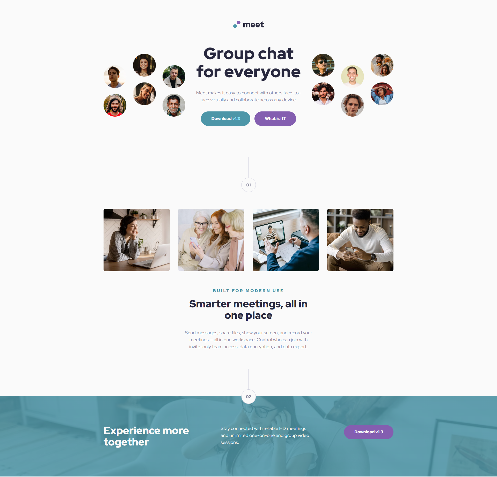

# Frontend Mentor - Meet landing page solution

This is a solution to the [Meet landing page challenge on Frontend Mentor](https://www.frontendmentor.io/challenges/meet-landing-page-rbTDS6OUR). Frontend Mentor challenges help you improve your coding skills by building realistic projects.

## Table of contents

- [Overview](#overview)
  - [The challenge](#the-challenge)
  - [Screenshot](#screenshot)
  - [Links](#links)
- [My process](#my-process)
  - [Built with](#built-with)
  - [What I learned](#what-i-learned)
  - [Continued development](#continued-development)
- [Author](#author)

## Overview

### The challenge

Users should be able to:

- View the optimal layout depending on their device's screen size
- See hover states for interactive elements

### Screenshot



### Links

- Solution URL: [Challenge Solution](https://your-solution-url.com)
- Live Site URL: [Live Demo](https://dz-meet-landing-page.vercel.app/)

## My process

### Built with

- Semantic HTML5 markup
- CSS custom properties
- Flexbox
- CSS Grid
- Mobile-first workflow
- BEM

### What I learned
In this challenge I learned how to work with `:has()` pseudo-class.

```css
.wrapper:has(.hero) {
  /* Some style here */
}
```

### Continued development
For future projects, I would like to learn how to work with **CUBE CSS** and improve my skills with **Semantic HTML** and **CSS**.  I want to become more confident with my knowledge and work at the pace of my mind.

## Author

- Frontend Mentor - [@dedo-dev](https://www.frontendmentor.io/profile/dedo-dev)
- Linkedin - [@daniele-zeppieri](https://www.linkedin.com/in/daniele-zeppieri-0b1a36252/)